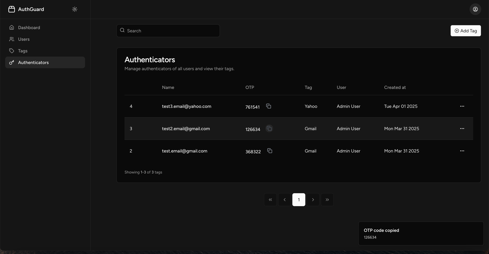
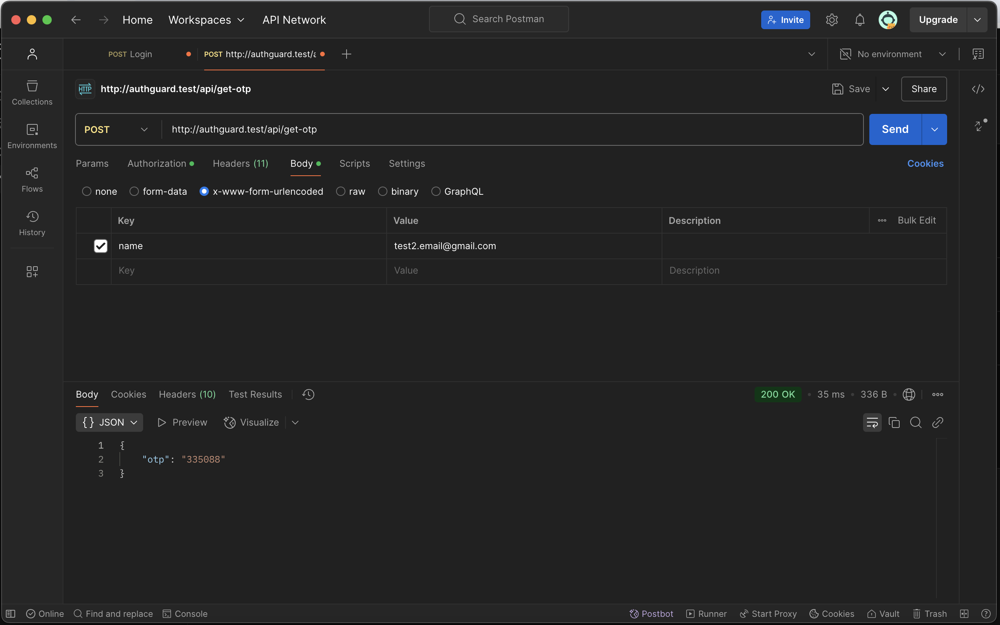

# AuthGuard

AuthGuard is a web application built using Vue.js and Laravel with Inertia.js. It manages OTP codes using a secret key, implements role-based access control with Spatie Permissions, and provides an API for requesting OTP codes.

🚀 Think of it like Google Authenticator, but instead of scanning a QR code, you manually enter a secret key to generate OTPs.

## Features

- **Vue.js & Laravel with Inertia.js** for a seamless SPA experience.
- **OTP Management** using a secret key.
- **Spatie Permissions** for role and permission handling.
- **API Integration** to request OTP codes securely.
- **Dark Mode**: Toggle dark mode on/off for a better visual experience.

## Technologies Used

- Laravel
- Vue.js
- Inertia.js
- Spatie Permissions
- API for OTP requests
- ShadCN Vue for UI components

## Installation

1. **Clone the repository:**

    ```sh
    git clone https://github.com/mehdighallam6/authguard.git
    cd authguard
    ```

2. **Install dependencies:**

    ```sh
    composer install
    npm install
    ```

3. **Set up environment variables:**

    ```sh
    cp .env.example .env
    ```

    - Update `.env` with database details.

4. **Generate application key:**

    ```sh
    php artisan key:generate
    ```

5. **Run migrations and seed user/roles**

    ```sh
    php artisan migrate
    ```

    ```sh
    php artisan db:seed
    ```

    After running the seeder, two users are available for testing:

    | Role         | Email                    | Password     |
    | ------------ | ------------------------ | ------------ |
    | **Admin**    | admin@authguard.hello    | admin@789    |
    | **Standard** | standard@authguard.hello | standard@123 |
    
    Admin: Has access to view all users' authenticators.
    
    Standard: Can only view their own authenticators.

    You can use these credentials to log in and test different role-based access levels.

6. **Build frontend assets:**

    ```sh
    npm run dev
    ```

## API Endpoints

All API endpoints require authentication using Laravel Sanctum except `/api/login`.

- `POST /api/login` - Authenticate user and get access token
- `POST /api/logout` - Logout and invalidate token
- `GET /api/user` - Get authenticated user details
- `POST /api/get-otp` - Request a new OTP code

## Screenshots

### Website


### API


